


  

<a href="assets/trailer.mp4">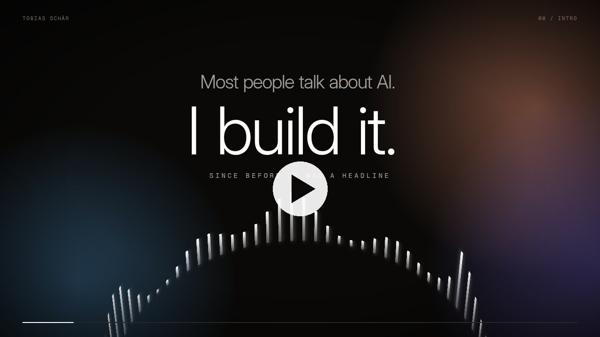</a>

60-second intro. Click to play.

## About

I build agentic workflows that teams depend on, and voice-first AI products people actually use. Seven years in IT infrastructure taught me to design with security, auditability and monitoring from day one. Based in Uster, Switzerland. I work in German and English.


## Eiren AI

**An AI meditation and personal growth app, designed, built and run solo.** An LLM writes a personal meditation from the user's state, ElevenLabs voices it, an AI coach connects data across the whole app, and an ElevenAgents voice agent answers questions on the website and in the app.

  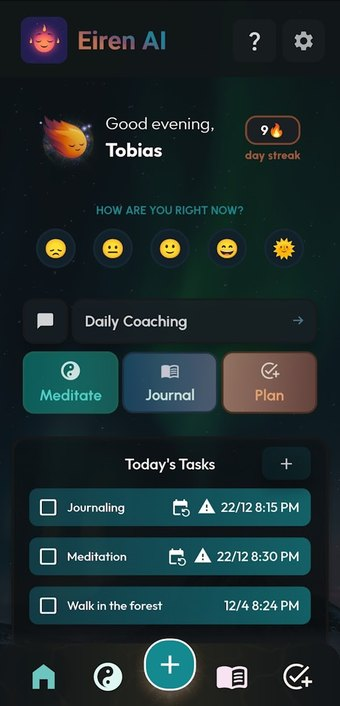
  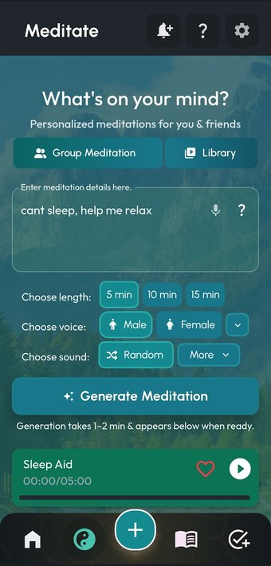
  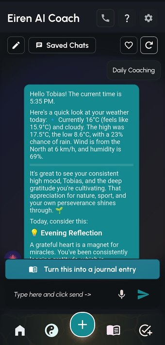
  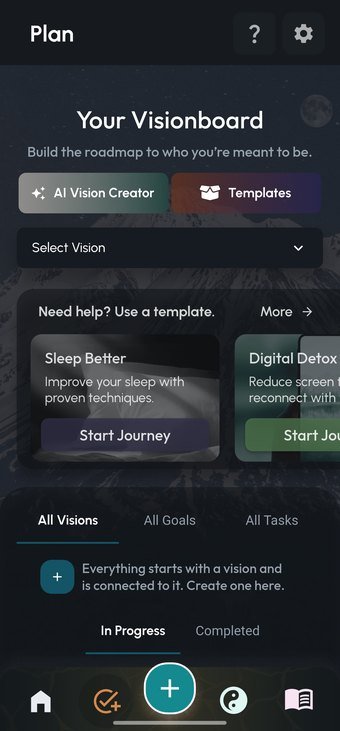
  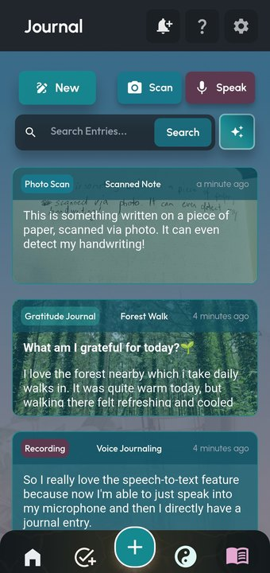


- Built with FlutterFlow, Firebase, Google Cloud, Buildship, OpenAI and ElevenLabs
- Featured by Google Play in "New Apps We Love"
- ElevenLabs Startup Grant (33M credits)
- Every subscription plants a tree (113 so far, via Treeapp)

[Website](https://eiren.ai) · [App Store](https://apps.apple.com/us/app/eiren-ai-meditation-growth/id6742199804) · [Google Play](https://play.google.com/store/apps/details?id=com.truenorthstudios.eirenai) · [YouTube](https://www.youtube.com/@EirenAI)

## Best of Swiss Apps 2025

**Gold in Innovation and Bronze in Functionality**, and one of eleven candidates for Master of Swiss Apps. On the award-night screen, client and contractor are the same name: Tobias Schär.

  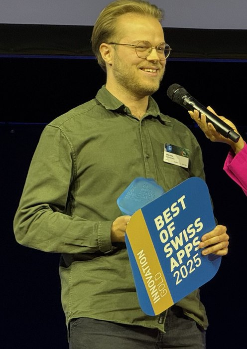
  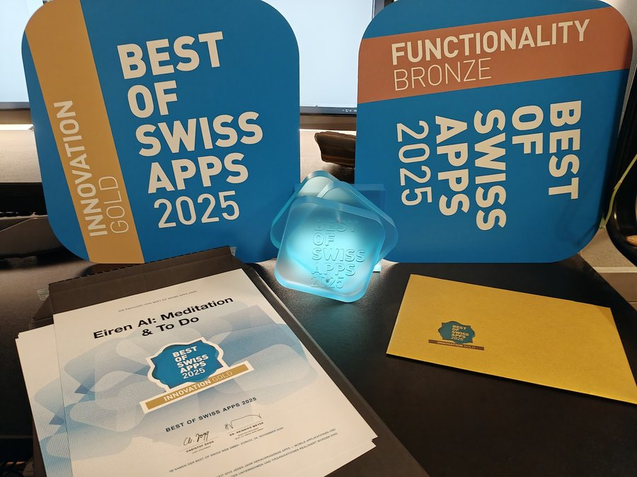
  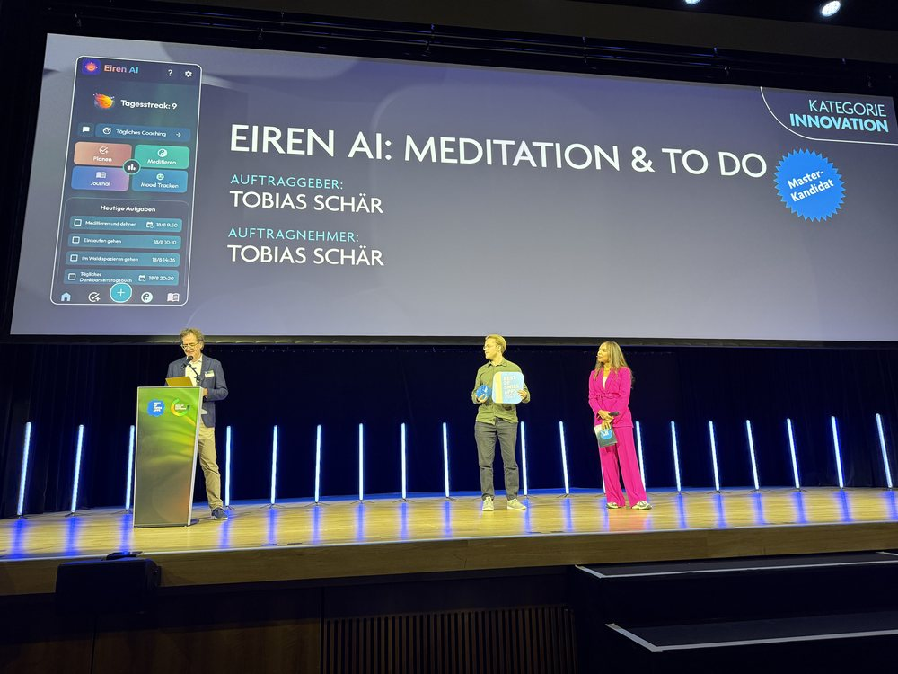

[Hall of fame](https://www.bestofswissapps.ch/bosa/hall-of-fame) · [Netzwoche](https://www.netzwoche.ch/news/2025-10-13/master-kandidat-eiren-ai-meditation-to-do)

## Enterprise automation

- n8n tool owner at Blinno (2026) for a large enterprise client: logging and monitoring concept, DEV/UAT/PROD staging, alignment between system and tool owners, HR process automation, API integrations. Client work, so no public code.
- Before that, seven years as a system engineer: servers, network, Microsoft 365, 2nd and 3rd level support for around 350 shops.

  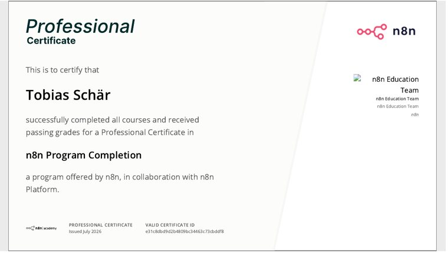
  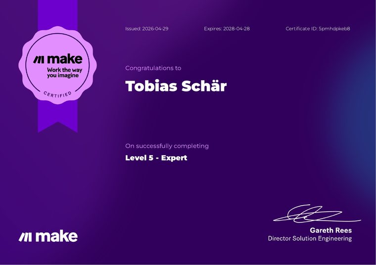
  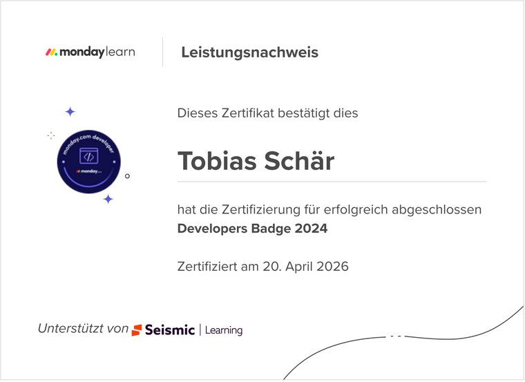

## A voice interface for my own systems

A personal system that connects all my projects, with an ElevenLabs agent as its voice interface. I say "open my weekly planning", the agent queries the database, controls the app by command, shows me the view and tells me out loud what is going on. Private for now.

## Also

- **InnerJourneyMusic**: AI-assisted music and visuals, two albums released in 2026
- **True North Collective**: a free meditation and personal growth community, 50+ members

## Stack

| | |
|---|---|
| **AI and agents** | Claude (Claude Code, MCP), OpenAI, Gemini, ElevenLabs TTS and ElevenAgents |
| **Automation** | n8n, Make, monday.com, Retool |
| **App and backend** | FlutterFlow, Firebase, Google Cloud, Buildship, JavaScript, Git |
| **Infrastructure** | Windows Server, Active Directory, Exchange, Microsoft 365, Intune, VMware |

## Contact

[LinkedIn](https://www.linkedin.com/in/tobias-sch%C3%A4r-6866a6190/) · [eiren.ai](https://eiren.ai) · [YouTube](https://www.youtube.com/@EirenAI)
